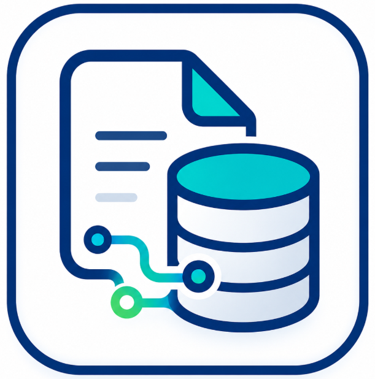
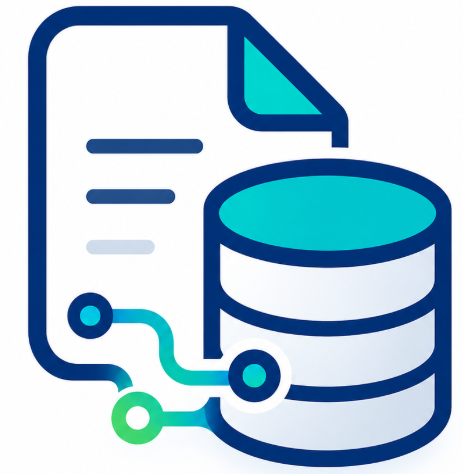

# FIDOCX

**Automatización documental para generar Word y PDF desde Excel, CSV, JSON o formularios.**

FIDOCX es una aplicación de escritorio para Windows diseñada para automatizar la creación de documentos repetitivos usando plantillas DOCX y fuentes de datos estructuradas.

---

## ¿Qué es FIDOCX?

**FIDOCX** permite cargar datos desde Excel, CSV, JSON o formularios, mapearlos visualmente hacia una plantilla Word y generar documentos de forma individual o masiva.

Está pensado para procesos administrativos donde se requiere generar documentos repetitivos como certificados, constancias, contratos, reportes, cartas, actas o fichas personalizadas.

---

## Funciones principales

* Carga de datos desde **Excel, CSV o JSON**.
* Selección de hoja de Excel y fila de cabecera.
* Mapeo visual de campos hacia plantillas **DOCX**.
* Soporte para campos simples, condiciones y tablas dinámicas.
* Creación de flujos reutilizables.
* Validación previa antes de generar documentos.
* Generación de documentos **DOCX**.
* Exportación a **PDF** mediante LibreOffice.
* Historial de documentos generados.
* Aplicación de escritorio para Windows.

---

## Casos de uso

FIDOCX puede utilizarse para generar:

* Certificados.
* Constancias.
* Contratos.
* Cartas.
* Reportes.
* Actas.
* Fichas administrativas.
* Documentos internos.
* Documentos masivos desde Excel.

---

## ¿Cómo funciona?

El flujo general de trabajo es:

1. Cargar una fuente de datos.
2. Seleccionar la hoja o registros a utilizar.
3. Cargar una plantilla DOCX.
4. Relacionar campos de datos con etiquetas de la plantilla.
5. Validar la información.
6. Generar documentos DOCX y, opcionalmente, PDF.

---

## Videos demo

Próximamente se publicarán videos demostrativos del funcionamiento de FIDOCX:

* Cargar Excel y seleccionar hoja.
* Mapear datos hacia una plantilla DOCX.
* Generar documentos Word desde Excel.
* Generar documentos PDF.
* Crear flujos reutilizables.
* Usar condiciones dentro de plantillas.

---

## Requisitos

* Windows 10 o Windows 11.
* LibreOffice opcional para exportar documentos a PDF.

> FIDOCX puede generar documentos DOCX sin LibreOffice.
> LibreOffice solo es necesario si se desea convertir los documentos a PDF.

---

## Acceso de prueba

El instalador de FIDOCX se entrega bajo solicitud.

Actualmente no se publica una descarga libre del instalador.

---

## Contacto

Para solicitar una demostración o acceso de prueba:

**Correo:** [cartolin.fidel@gmail.com](mailto:cartolin.fidel@gmail.com)

**LinkedIn:** [Fidel Cartolin Rojas](https://www.linkedin.com/in/fidel-cartolin-rojas/)

---

## Estado del proyecto

FIDOCX se encuentra en desarrollo y mejora continua.

Se están incorporando nuevas funciones para facilitar la automatización documental, mejorar la generación masiva y optimizar la experiencia de usuario en escritorio.

---

**FIDOCX — Procesos documentales configurables**

